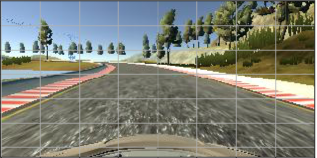
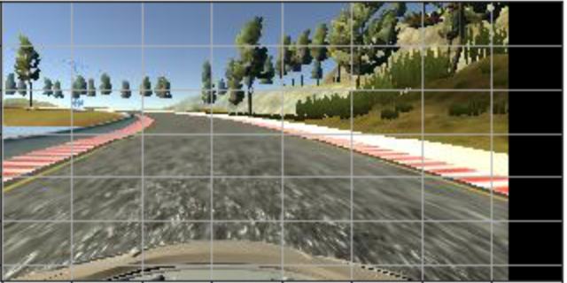
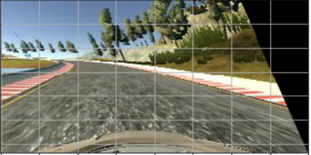
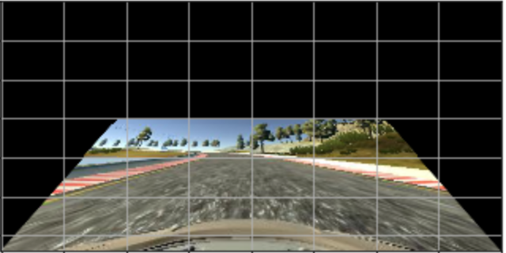
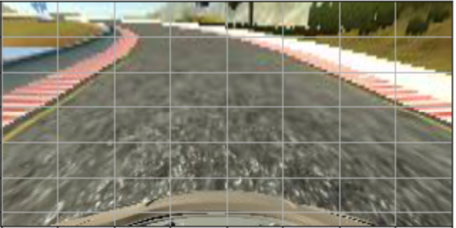
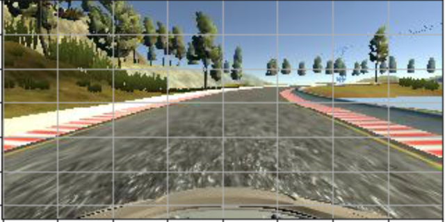

# **Behavioral Cloning Project**

### Writeup - Submitted by Deepak Mane

---

The goals / steps taken to completed this Project are as follows:
* Used the simulator to collect data of good driving behavior [ Provided by Udacity from [here] ](https://github.com/udacity/self-driving-car-sim)
* Saved the Data on Local system under ~/Desktop/data
* Validated the mimium dependences (CarND Term1 Starter Kit as reference) for running the Project like (Python3, TensorFlow, Keras, Numpy, OpenCV)
* Built, a convolution neural network in Keras that predicts steering angles from images
* Trained and validated the model with a training and validation set on both the Tracks
* Tested that the model successfully drives around track one without leaving the road. Attempted to test the car to Run on track two but it was not successful. Posted below few findings about it.
* Summarized the results with a written report as Below


[//]: # (Image References)

[image1]: ./writeup_images/00_original.png "Normal Image"
[image2]: ./writeup_images/01_translate.png "Grayscaling"
[image3]: ./writeup_images/02_curvature.png "Recovery Image"
[image4]: ./writeup_images/03_incline_down.pn "Recovery Image"
[image5]: ./writeup_images/04_incline_up.png "Recovery Image"
[image6]: ./writeup_images/05_flip.png "Flipped Image"
[image7]: ./writeup_images/placeholder_small.png 


## Rubric Points
### Here I will consider the [rubric points](https://review.udacity.com/#!/rubrics/432/view) individually and describe how I addressed each point in my implementation.  

---
### Required Files

#### 1. Submission includes all required files and can be used to run the simulator in autonomous mode

* Are all required files submitted?]

SPECIFICATION : My project includes the following files:
* model.py :- This is the script created to train the model
* drive.py :- This script is as used without any changes for driving the car in autonomous mode
* model.h5 :- This file has the data which represents trained convolution neural network 
* writeup_report.md :- Summarizes the results

### Quality of Code
#### 2. Submission includes functional code
* Is the code functional?	
* Is the code usable and readable?

SPECIFICATION : 

The model provided can be used to successfully operate the simulation.The code in model.py uses a Python generator, if needed, to generate data for training rather than storing the training data in memory. The model.py code is clearly organized and comments are included where needed.

Using the Udacity provided simulator and my drive.py file, the car can be driven autonomously around the track by executing 
```sh
python drive.py model.h5
```
The model.py file contains the code for training and saving the convolution neural network. The file shows the pipeline I used for training and validating the model, and it contains comments to explain how the code works.


### Model Architecture and Training Strategy

* Has an appropriate model architecture been employed for the task?	The neural network uses convolution layers with appropriate filter sizes. Layers exist to introduce nonlinearity into the model. The data is normalized in the model.
* Has an attempt been made to reduce overfitting of the model?	Train/validation/test splits have been used, and the model uses dropout layers or other methods to reduce overfitting.
* Have the model parameters been tuned appropriately?	Learning rate parameters are chosen with explanation, or an Adam optimizer is used.
* Is the training data chosen appropriately?	Training data has been chosen to induce the desired behavior in the simulation (i.e. keeping the car on the track).

SPECIFICATION : 

#### An appropriate model architecture has been employed

I trained modified version of [this](https://github.com/commaai/research/blob/master/train_steering_model.py) Comma.ai model. Instead of trying multiple architectures I choose Comma.ai model and decided to train it well enough to make the car driving successfully on track one. Architecure plays a important role so having read on many other I decided to proced with below 

Instead of following the conv layers with max pooling layers I used a convolutional stride greater than 1, namely 4 for the first conv layer and 2 for the second and third conv layers. I didn't do this because I had good theoretical reasons for it, but because the Comma.ai model that my model is based on did it this way and I considered it an experiment to see if it would produce good results. Intuitively, reducing complexity through pooling should be superior over reducing complexity by increasing the stride in the conv layers, since the former method chooses the most relevant information out of all possible filter positions, while the latter method loses information by skipping part of the possible filter positions to begin with. In practice, however, it seems to work well enough.

#### Attempt been made to reduce overfitting of the model
Along with proper architectures, the data you collect and the data augmentation techniques you apply are also equally crucial. To make the first run the car on track one it took quite a while and the majority of efforts where spend on the collection and processing of the training data rather than parameter tunning of the  model.

Batch normalization helps reduce overfitting, so tried removing the dropout layers.Did not encounter signs of overfitting in general, even without the dropout layers.

The model uses an Adam optimizer with the default learning rate of 0.001 and a decay of 5e-05. Training will stop early and the learning rate will be reduced in case of the validation loss plateauing for several epochs in a row, see the callbacks in line 721 of model.py.

The final step was to run the simulator to see how well the car was driving around track one. 

At the end of the process, the vehicle is able to drive autonomously around the track without leaving the road.

Data Collection-Preprocessing
The simulator records image data from three cameras, one center camera and one camera on each the far left and right sides of the car, recording 10 images per second. The images from the two non-center cameras simulate the effect of the car being too far left or too far right in the lane and by adding or subtracting an appropriate offset to/from the respective center camera steering angle, one can effectively produce artificial recovery data.

Note that I deliberately did not record any recovery data, i.e. I did not record any data of the car correcting its course from the edges of the lane back towards the center. Since real cars on real roads cannot really make use of this technique and can still learn how to drive autonomously, my model should be able to learn without such data, too. Instead I used the data from all three cameras for the training and hoped that the left and right camera images and some geometric transformations of the images would be enough to produce the same effect that recovery data would, which turned out to be true. Not to mention that it is a lot more efficient than recording lots of manually produced recovery data.

I recorded roughly four laps (maybe it was a bit less) of good driving behavior in the default direction (counter-clockwise) on the lake track (track 1), followed by roughly four laps in the reverse direction (clock-wise). I ended up with a little more than 45,000 images when I was done recording, i.e. around 15,000 per camera.

With that data from the lake track only I wanted to get the model to master the lake track and see how far I would get on the mountain and jungle tracks without using any data recorded on those tracks.

I also recorded around 36,000 images of good driving behavior on the jungle track, i.e. around 12,000 images per camera.

I reduced the original size of the recorded images (160x320 pixels) by half in both dimensions to 80x160 pixels and then cropped 20 pixels at the top and 10 pixels at the bottom because they only contain the sky and the hood of the car - visual information that is irrelevant to predict the steering angle. I also cropped 5 pixels each on the left and right for the same reason. It might be useful to crop even more pixels from the top to eliminate even more irrelevant or even misleading image information, but I got satisfactory results with this processing.

#### Model parameter tuning

The model used an adam optimizer, so the learning rate was not tuned manually (model.py line 25).

####  Appropriate training data

Steering Angle Adjustment for the Left and Right Camera Images
The images from the two non-center cameras unsurprisingly turned out to be very useful to train off-center recovery. Experiments with different steering angle adjustments for the left and right cameras by adding/subtracting constants ranging from 0.1 to 0.25 yielded adjustments of 0.15-0.2 to be reasonable values. I also experimented with non-constant adjustment values that depend on the magnitude of the center camera steering angle, the reasoning being that the larger the curve radius, the more time the car has to revert back towards the center of the lane, allowing for smoother corrections, while the sharper the curve, the faster the car has to revert back toward the center. By contrast, if the angle adjustment is an additive constant, the correction back to the center of the lane is always equally fast (which means equally abrupt), regardless of the curvature of the road. I ended up discarding the magnitude-dependent approach though, since it introduced more complexity for unclear gain.

Of course non-center camera images are just two specific cases of horizontal translation, and as will be described in the next section, I applied horizontal translation randomly to the entire training dataset to generate many more different viewpoints.

### Architecture and Training Documentation

* Is the solution design documented?	The README thoroughly discusses the approach taken for deriving and designing a model architecture fit for solving the given problem.
* Is the model architecture documented?	The README provides sufficient details of the characteristics and qualities of the architecture, such as the type of model used, the number of layers, the size of each layer. Visualizations emphasizing particular qualities of the architecture are encouraged.
* Is the creation of the training dataset and training process documented?	The README describes how the model was trained and what the characteristics of the dataset are. Information such as how the dataset was generated and examples of images from the dataset must be included.

SPECIFICATION : 

#### Solution Design is embeded into the script model.py
The part of the model.py file that contains the code for creating, training and saving the Keras model starts in line 643. The lines before define a number of helper functions that are part of the overall training pipeline: An `assemble_filelists()` function to assemble lists of the available training data from the drive_log.csv file that the simulator creates when recording driving data, a `generate_batch()` generator function used by Keras' `fit_generator()` function to train the model, and a bunch of image transformation functions that are used by the generator to do ad-hoc data augmentation during training.

#### Final Model Architecture Documentation

The architecture of the final model is as follows (model.py):
* RGB image input with dimensions 80x160x3
* Keras Cropping2D layer to crop the input to 50x150 pixels
* Keras Lambda layer to convert the feature value range to [-1,1]
* Three convolutional layers with 32, 64, and 128 filters, filter sizes 8x8, 5x5, and 3x3, and strides 4, 2, and 2.
* One dense layer with 512 units following the convolutional layers, and one output unit
* ELUs as nonlinearities after each layer except the output unit
* Batch normalization after each layer except the output unit
* Dropout after the third conv and first dense layer (both rate 0.5)

The visualization of the architecture was mentioned as optional according to the project rubric so didn't include a image here.

#### Creation of the training dataset and training process 

* Data Augmentation

Data augmentation is essential to solve this problem, training on data of good driving behavior alone will not result in a working model. At the same time data augmentation is also more complex in this case than in a classification task, since for many relevant transformations of the input data, the corresponding labels need to be adjusted in a non-trivial way. A bear is a bear whether you flip the image or not, but the steering angle of the perspectively distorted image of a road might need to be adjusted in a non-obvious way. Figuring out how exactly to adjust the steering angle for some transformations turns into a project of its own, and a lot of work goes into it. Below I describe the transformations I experimented with and my findings regarding which transformations worked or didn't work, which were useful or unnecessary, and what steering angle adjustments turned out to work well.

I tested the following image transformations:

* Flipping images horizontally to prevent a bias towards being able to handle some situations only in one direction but not the other. The steering angle is being inverted (additive inverse) accordingly.
* Changing the brightness, particularly decreasing it, to make the model less dependent on certain colors, to make it recognize lane markings with less contrast, and to cater to the darker colors of the mountain track.
* Three kinds of transformations came to my mind as possible candidates to recover from off-center positions and to ensure that the model can handle sharp curves: Rotation, horizontal translation, and a perspective transform simulating a change in the curvature of the road. I tested the effectiveness of all three and report my findings below.
* Transforming the perspective to simulate an incline change uphill or downhill. The purpose of this was to use the data from the flat lake track to train the model for the mountain and jungle tracks, both of which contain many slope changes.

Here is an example of some of these transformations. The original image for comparison (steering angle == 0.00):



Translated horizontally by 30 pixels (steering angle == -0.09):



Perspective transform to simulate a left turn / orientation of the car to the right edge of the lane (steering angle == -0.32):



Perspective transform to simulate a downhill road (steering angle == 0.00):



Perspective transform to simulate an uphill road (steering angle == 0.00):



Horizontal flip (steering angle == -0.00):



Results of my data augmentation experiments:

* Horizontal flipping: It helps a lot and should always be applied (randomly to half of your data).
* Changing the brightness: It had exactly the desired effect. Decreasing the brightness of the lake track images, the model was able to drive on the much darker mountain track without ever having seen it during training. Depending on the training iteration, I randomly varied the brightness of 10-50% of the images between factor 0.4 and 1.5 of the original brightness.
* Translation: Horizontal translation is just an extension of the effect of using the left and right camera images and is very helpful, if not essential, to training a model that stays close to the center of the lane. I randomly translated the images by 0 to 40 pixels, sometimes 0 to 50 pixels. Steering angle adjustments of 0.003-0.004 per pixel of translation turned out to yield reasonable correction speeds that are neither too abrupt on straight roads nor too slow in sharp curves. Vertical translation turned out to be unnecessary. I did it a little bit (0-10 pixels) just to create more diverse data, but vertical translation does not serve as an even remotely realistic proxy for simulating changes in the slope of the road.
* Curvature perspective transform: This turned out to be useful to simulate sharper curves on the one hand, but even more importantly it simulates situations in which the car is oriented at an angle to the lane rather than parallel to the lane. The image above illustrates this effect. If you compare the central vertical gridline in the original image and the distorted image you see that the distorted image simulates the car being oriented toward the side of the lane rather than toward the center of the road as in the original image. Of course, this primitive perspective distortion is a very imperfect proxy for a change in the curvature of the road. To truly increase the sharpness of a curve in a realistic way for example, one can of course not just shift the pixels in the linear way that this transform does, but this approximation still did an alright job. In order to understand the steering angle adjustment factor you would have to read the code, but I documented the generator function in great detail in case you're interested.
* Rotation: I experimented with rotating images to simulate a change in the curvature of the road, but in most cases this does not yield a realistic approximation, and more importantly it is inferior to the perspective transform described above. I did not end up using this transform.
* Incline perspective transform: While it generally actually is a more realistic approximation than the curvature transform above, it turned out to be completely unnecessary - I did not end up using this.

All the transforms above are defined as small helper functions in lines 117-250 of model.py.

The function that actually applies these transformations is the generator function defined in lines 254-639 of model.py. The large number of code lines is mostly owed to detailed documentation and to distinguishing between different cases triggered by options in the arguments. In a nutshell, it loads batches of training data and labels, applies the transforms specified in the arguments, yields the results, shuffles the dataset upon each complete pass, and can do this indefinitely. Each transform has its own independent application probability and some can choose from a number of modes to operate in - see the documentation.

The generator function provides some options to apply the above image transforms in a more targeted way. For example, for the curvature transformation, the `mode` argument specifies whether all images are eligible for a given transform, or only images with a certain minimum or maximum corresponding absolute steering angle, or only to images with a corresponding steering angle that is positive or negative. During training, it sometimes proved helpful to apply the curvature transform only to images of an already curved road. It was also better to apply the artificial curvature only in the same direction as the original curvature. The likely reason for this phenomenon is that the steering angle adjustment associated with the artificial curvature change is not chosen perfectly, and if a road that was curved to the left is artificially straightened by being transformed to the right does not end up with the appropriate steering angle (e.g. zero), then this creates conflicting training data.

Note that `assemble_filelists()` returns the steering angle list as a list with two columns, containing not only the steering angle, but also the original steering angle of the center camera version of the respective image. The reason for this is that the original center camera steering angle is a reasonable indicator for the actual curvature of the road (assuming that I drove relatively cleanly along the trajectory of the road) while the adjusted steering angles of the left and right camera images are not. Example: If an image has a steering angle of -0.15, it might be a slight left turn, but it might also be the right camera image of a straight part of the road (or neither). Hence it is useful to preserve the original steering angle associated with the center camera image for all images. The `mode` option in the generator function uses this original center camera steering angle to decide which images are eligible for transformation an which aren't. 

####  Validation

Validation dataset was used, but even if validation error is helpful to monitor overfitting and to make sure that your model is getting better, the main criteia to look for is if you can drive the car around the entire track, and the validation error can't tell you when that point is reached (if your validation dataset even reflects all relevant situations!). The validation error played only a small role for the decisions I made, the crucial and more insightful test is to watch your model drive in autonomous mode.

#### Training Process

Data augmentation helped the model to drive well on  the lake but not on jungle track. During training. 10 epochs on 90% (the remaining 10% were held out for validation) of the the 45,000-image dataset recorded on the lake track were enough to achieve this.

Trying to get the model to work on the very different and much more challenging jungle track while training it only on the lake track date was unsuccessful. However, even after training it on jungle track data I initially had difficulties getting it to drive on that track. I anticipated that sharp turns would be an issue, but those didn't cause any problems. There were three other leading causes of failure in my training results - see the images below. The first were sudden downhill parts where a sharp edge marks the end of the visible road before it goes downhill and the car cannot see early enough what comes after. This problem was sometimes exacerbated by the second leading cause of failure, unrelated road stretches on the horizon creating the optical illusion of being the continuations of the road the car is currently on, leading the model to follow the road stretch on the horizon rather than the road it was on. The third leading cause of failure were the two directly adjacent road stretches at the start of the track. The road is completely straight there, but my model initially still had difficulties staying straight, it always wanted to pull over to the other side of the road. It took recording a bunch of extra data on this stretch at the start to get this problem under control.

### Simulation / Training Result

* Is the car able to navigate correctly on test data?

SPECIFICATION : 

As was the Goal fo this project , None of the tires leave the drivable portion of the track surface. The car doesn't pop up onto ledges or roll over any surfaces that would otherwise be considered unsafe (if humans were in the vehicle). As per the requirement car drives well on Track1  -Lakeside

[!01_Lake_Track ](./run.mp4)

### Improvments

There is still lot of scope of Improvement for the car to be driven on the Jungle Track2.
The Challening parts faced were :-
Even though it was a problem initially on the jungle track when I didn't limit car's speed, because it would get too fast downhill and miss immediately consecutive turns, surprisingly I managed to get it to a point where it can run laps on the jungle track even without any speed limitation if the default throttle is set to 0.2. I still modified the drive.py to ensure a minimum speed of 12 mph (because otherwise watching the car drive on the jungle track is tedious) and a maximum of 24 mph so that the car drives more smoothly. Feel free to remove the max speed though - the driving will be less clean, but it will still work.
