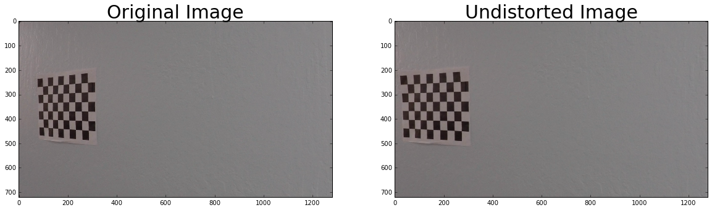
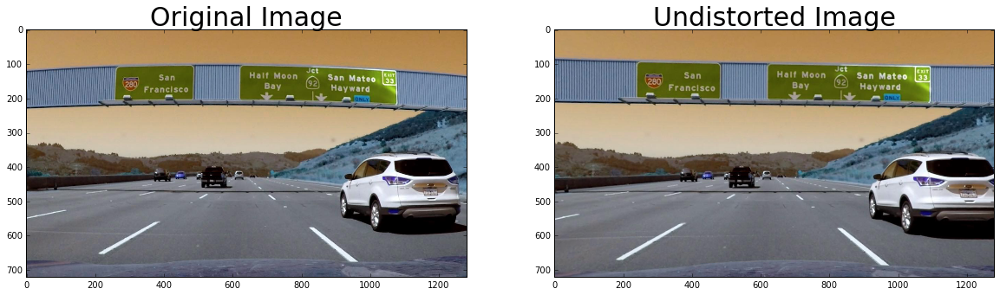
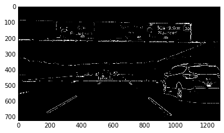
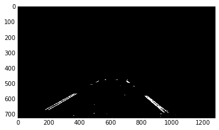
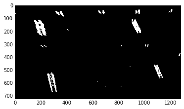
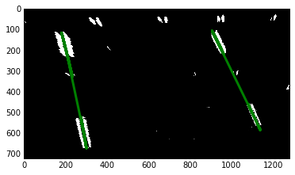
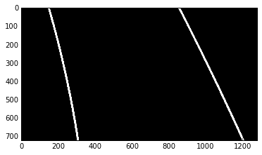
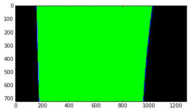
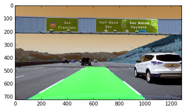
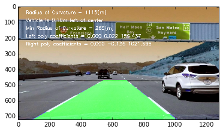

# **Advanced Lane Finding**

### Writeup - Submitted by Deepak Mane

---

The Steps taken to complete Project are as follows (which is also the PIPELINE mentioned in `.ipynb` file):  

* STEP1. Compute the camera calibration matrix and distortion coefficients given a set of chessboard images.
* STEP2. Apply the distortion correction to the raw image.  
* STEP3. Use color transforms, gradients, etc., to create a thresholded binary image.
* STEP4. Apply a perspective transform to rectify binary image ("birds-eye view"). 
* STEP5. Detect lane pixels and fit to find lane boundary.
* STEP6. Determine curvature of the lane and vehicle position with respect to center.
* STEP7. Warp the detected lane boundaries back onto the original image.
* STEP8. Output visual display of the lane boundaries and numerical estimation of lane curvature and vehicle position.

The Goal of this Project is to find the Lane Lines using advanced methodology on the provided video clipping.

### Navigating this directory
* Project pipelines are in [Project4_Advance-Lane-Lines.ipynb](https://github.com/deepak-mane/SDCND/blob/master/Term1-P4-Advanced-Lane-Lines/Project4_Advance_Lane_Lines.ipynb).
* The images for camera calibration are stored in the folder called [camera_cal](https://github.com/deepak-mane/SDCND/blob/master/Term1-P4-Advanced-Lane-Lines/camera_cal).  
* The images in [test_images](https://github.com/deepak-mane/SDCND/blob/master/Term1-P4-Advanced-Lane-Lines/test_images) are for testing your pipeline on single frames.
* The images in [output_images](https://github.com/deepak-mane/SDCND/blob/master/Term1-P4-Advanced-Lane-Lines/output_images) are from Output from each stage of Pipeline.

---
## Rubric Points
### Here I will consider the [rubric points](https://review.udacity.com/#!/rubrics/432/view) individually and describe how I addressed each point in my implementation.  

### [ 1.] Required Files

* Are all required files submitted?

SPECIFICATION :  My project includes the following files:
* model.py :- This is the script created to train the model
* drive.py :- This script is as used without any changes for dri

## Project Outline:
The code for each step is in the correspondingly named section of `./Project4_Advance-Lane-Lines.ipynb`.


Writeup / README
CRITERIA	MEETS SPECIFICATIONS
Provide a Writeup / README that includes all the rubric points and how you addressed each one. You can submit your writeup as markdown or pdf. Hereis a template writeup for this project you can use as a guide and a starting point.	The writeup / README should include a statement and supporting figures / images that explain how each rubric item was addressed, and specifically where in the code each step was handled.
Camera Calibration
CRITERIA	MEETS SPECIFICATIONS
Briefly state how you computed the camera matrix and distortion coefficients. Provide an example of a distortion corrected calibration image.	OpenCV functions or other methods were used to calculate the correct camera matrix and distortion coefficients using the calibration chessboard images provided in the repository (note these are 9x6 chessboard images, unlike the 8x6 images used in the lesson). The distortion matrix should be used to un-distort one of the calibration images provided as a demonstration that the calibration is correct. Example of undistorted calibration image is Included in the writeup (or saved to a folder).
Pipeline (test images)
CRITERIA	MEETS SPECIFICATIONS
Provide an example of a distortion-corrected image.	Distortion correction that was calculated via camera calibration has been correctly applied to each image. An example of a distortion corrected image should be included in the writeup (or saved to a folder) and submitted with the project.
Describe how (and identify where in your code) you used color transforms, gradients or other methods to create a thresholded binary image. Provide an example of a binary image result.	A method or combination of methods (i.e., color transforms, gradients) has been used to create a binary image containing likely lane pixels. There is no "ground truth" here, just visual verification that the pixels identified as part of the lane lines are, in fact, part of the lines. Example binary images should be included in the writeup (or saved to a folder) and submitted with the project.
Describe how (and identify where in your code) you performed a perspective transform and provide an example of a transformed image.	OpenCV function or other method has been used to correctly rectify each image to a "birds-eye view". Transformed images should be included in the writeup (or saved to a folder) and submitted with the project.
Describe how (and identify where in your code) you identified lane-line pixels and fit their positions with a polynomial?	Methods have been used to identify lane line pixels in the rectified binary image. The left and right line have been identified and fit with a curved functional form (e.g., spine or polynomial). Example images with line pixels identified and a fit overplotted should be included in the writeup (or saved to a folder) and submitted with the project.
Describe how (and identify where in your code) you calculated the radius of curvature of the lane and the position of the vehicle with respect to center.	Here the idea is to take the measurements of where the lane lines are and estimate how much the road is curving and where the vehicle is located with respect to the center of the lane. The radius of curvature may be given in meters assuming the curve of the road follows a circle. For the position of the vehicle, you may assume the camera is mounted at the center of the car and the deviation of the midpoint of the lane from the center of the image is the offset you're looking for. As with the polynomial fitting, convert from pixels to meters.
Provide an example image of your result plotted back down onto the road such that the lane area is identified clearly.	The fit from the rectified image has been warped back onto the original image and plotted to identify the lane boundaries. This should demonstrate that the lane boundaries were correctly identified. An example image with lanes, curvature, and position from center should be included in the writeup (or saved to a folder) and submitted with the project.
Pipeline (video)
CRITERIA	MEETS SPECIFICATIONS
Provide a link to your final video output. Your pipeline should perform reasonably well on the entire project video (wobbly lines are ok but no catastrophic failures that would cause the car to drive off the road!)	The image processing pipeline that was established to find the lane lines in images successfully processes the video. The output here should be a new video where the lanes are identified in every frame, and outputs are generated regarding the radius of curvature of the lane and vehicle position within the lane. The pipeline should correctly map out curved lines and not fail when shadows or pavement color changes are present. The output video should be linked to in the writeup and/or saved and submitted with the project.
Discussion
CRITERIA	MEETS SPECIFICATIONS
Briefly discuss any problems / issues you faced in your implementation of this project. Where will your pipeline likely fail? What could you do to make it more robust?	Discussion includes some consideration of problems/issues faced, what could be improved about their algorithm/pipeline, and what hypothetical cases would cause their pipeline to fail.
Suggestions to Make Your Project Stand Out!


## I. Camera Calibration

### 1. Computing the camera matrix and distortion coefficients
This was done in Step 1 of the ipynb.
* Read in calibration images.
* Generate object points (points I want to map the chessboard corners to in the undistorted image).
* Find the image points (chessboard corners) using `cv2.findChessboardCorners`.
* Calibrate the camera and obtain distortion coefficients using `cv2.calibrateCamera`.

#### Example of a distortion corrected calibration image.



## Image Pipeline

### 2. Apply distortion correction to each image
* Apply `cv2.undistort` with the camera matrix and distortion coefficients obtained in Step 1. 

#### Example of a distortion-corrected image


### 3. Create a thresholded binary image

* Threshold x gradient (for grayscaled image)
* Threshold colour channel (S channel)
* Combine the two binary thresholds to generate a binary image.
* The parameters (e.g. thresholds) were determined via trial and error (see Discussion). 
    * Improvement: determine the parameters in a more rigorous way.

#### Example of a thresholded binary image



### 4. Perspective transform
* Select only a hard-coded region of interest using a binary mask.


* Transform the image from the car camera's perspective to a birds-eye-view perspective.
* Hard-code the source and destination polygon coordinates and obtain the matrix `M` that maps them onto each other using `cv2.getPerspective`.
* Warp the image to the new birds-eye-view perspective using `cv2.warpPerspective` and the perspective transform matrix `M` we just obtained.

#### Example of a transformed image
Before (masked):


After:



### 5. Identify lane-line pixels and fit their positions with a polynomial

#### Identify lane line pixels
* Divide the image into `n` horizontal strips (steps) of equal height.
* For each step, take a count of all the pixels at each x-value within the step window using a histogram generated from `np.sum`.
* Smoothen the histogram using `scipy.signal.medfilt`.
* Find the peaks in the left and right halves (one half for each lane line) histogram using `signal.find_peaks_swt`.
* Get (add to our collection of lane line pixels) the pixels in that horizontal strip that have x coordinates close to the two peak x coordinates.

#### Fit positions of lane-line pixels with a polynomial
* Fit a second order polynomial to each lane line using `np.polyfit`.

#### Example plot
Polynomial fitted to birds-eye-view image:



Polynomial drawn on image using helper function `draw_poly`:



Lane line area highlighted using helper function `highlight_lane_line_area`:



### 6. Calculate the radius of curvature of the lane and the position of the vehicle with respect to the center

* Code: `left_curverad = ((1 + (2*left_fit[0]*y_eval + left_fit[1])**2)**1.5) /np.absolute(2*left_fit[0])`


### 7. Plot result back down onto tho road such that the lane area is identified clearly.
* Warp lane lines back onto original image (car camera's perspective) using `cv2.warpPerspective`.
* Combine lane lines with original image (version corrected for distortion) using `cv2.add`.

#### Result: Lane lines combined with original image:



### 8. Output visual display of the lane boundaries and numerical estimation of lane curvature and vehicle position.



## IIB. Streamlined Image Pipeline

See Section IIB of `p4-advanced-lane-lines.ipynb` for the streamlined image pipeline that incorporates the video pipeline checks discussed below.


## III. Pipeline (Video)

I condensed the operations into a single function `image_pipeline` in the ipynb enabled by helper functions in the file `helperfunctions.py`.

Code:
```
from moviepy.editor import VideoFileClip

output = 'project_output.mp4'
clip1 = VideoFileClip("project_video.mp4").subclip(0,5)
output_clip = clip1.fl_image(image_pipeline)
%time output_clip.write_videofile(output, audio=False)
```

I also added a few checks to eliminate and overwrite implausibly drawn lane lines, which I discuss in the section below.

[Video output](./project_output.mp4)

## IV. Discussion

* Problem 1: Noise interfering with detection of lane lines, resulting in lines with higher curvature being drawn
    * Instance 1: `test1.jpg`
        * Solution: increase the minimum threshold for the x gradient from 20 to 40 to filter out noise. (Increasing it to 50 left out parts of the lane.)
    * Instance 2: `test6.jpg`
        * Solution: Add a positive horizontal offset so the parts to the far right are not included in the histogram.

* Problem 2: No lane line detected (usually right lane line)
    * Solution: Relax x gradient and S channel thresholds using a `while` loop that relaxes the thresholds by a tiny amount and then repeats the detection process if no lane line is detected. This allows us te relax the thresholds when no lane line is detected without adding noise to frames where lane lines were detected on the first go (e.g. if we'd just changed the thresholds directly).
    
* Problem 3: Overly curvy (or otherwise implausible) lane lines drawn
    * Solution: Check for two things. If either criteria is not met, replace the lane line for this frame with the previous accepted lane line if it exists. This approximation works because lane lines are continuous and do not change shape quickly.
        * Criteria 1: Curvature is plausible, i.e. radius of curvature is smaller than 500m. (`plausible_curvature`)
        * Criteria 2: The lane lines drawn are similar to the previous set of (accepted) lane lines drawn. (`plausible_continuation_of_traces`)
