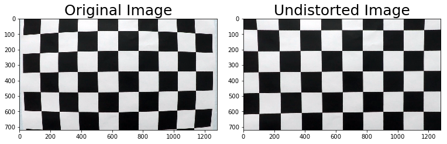
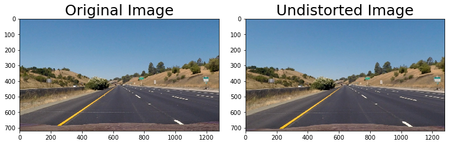
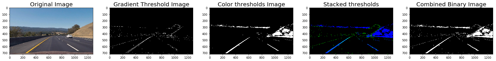
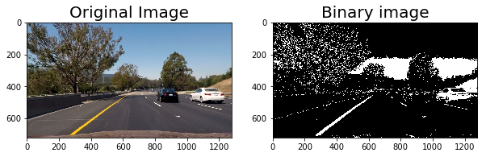
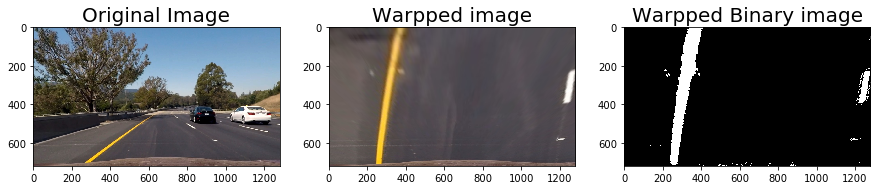
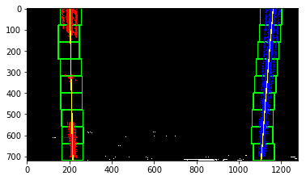
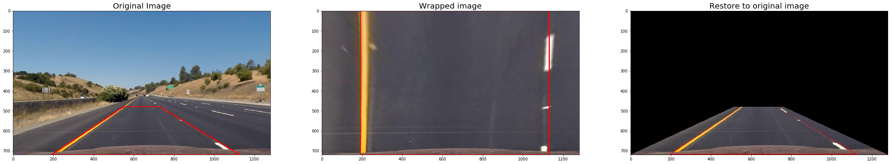
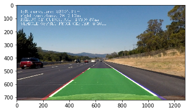

# **Advanced Lane Finding**

### Writeup - Submitted by Deepak Mane

---
## Project Outline:

The goals / steps of this project are the following:

* Compute the camera calibration matrix and distortion coefficients given a set of chessboard images.
* Apply a distortion correction to raw images.
* Use color transforms, gradients, etc., to create a thresholded binary image.
* Apply a perspective transform to rectify binary image ("birds-eye view").
* Detect lane pixels and fit to find the lane boundary.
* Determine the curvature of the lane and vehicle position with respect to center.
* Warp the detected lane boundaries back onto the original image.
* Output visual display of the lane boundaries and numerical estimation of lane curvature and vehicle position.
* The images for camera calibration are stored in the folder called camera_cal. The images in test_images are for testing your pipeline on single frames. If you want to extract more test images from the videos, you can simply use an image writing method like cv2.imwrite(), i.e., you can read the video in frame by frame as usual, and for frames you want to save for later you can write to an image file.

The Goal of this Project is to find the Lane Lines using recently learnt features such as perspective transform,Warp etc on the provided video clipping.

---
## Rubric Points
### Here I will consider the [rubric points](https://review.udacity.com/#!/rubrics/571/view) individually and describe how I addressed each point in my implementation.  

### [ 1.] Writeup / README

* Provide a Writeup / README that includes all the rubric points and how you addressed each one. You can submit your writeup as markdown or pdf. Hereis a template writeup for this project you can use as a guide and a starting point.	The writeup / README should include a statement and supporting figures / images that explain how each rubric item was addressed, and specifically where in the code each step was handled.

SPECIFICATION :  My project includes the following files:
* `Project4_Advance_Lane_Lines_writeup_report.md`:- This is the writeup which is submitted for this project.
* Code for Project pipeline is in [Project4_Advance-Lane-Lines.ipynb](https://github.com/deepak-mane/SDCND/blob/master/Term1-P4-Advanced-Lane-Lines/Project4_Advance_Lane_Lines.ipynb).
* The images for camera calibration are stored in the folder called [camera_cal](https://github.com/deepak-mane/SDCND/blob/master/Term1-P4-Advanced-Lane-Lines/camera_cal).  
* The images in [test_images](https://github.com/deepak-mane/SDCND/blob/master/Term1-P4-Advanced-Lane-Lines/test_images) are for testing your pipeline on single frames.
* The images in [output_images](https://github.com/deepak-mane/SDCND/blob/master/Term1-P4-Advanced-Lane-Lines/output_images) are from Output from each stage of Pipeline.

### [ 2.] Camera Calibration

* Briefly state how you computed the camera matrix and distortion coefficients. Provide an example of a distortion corrected calibration image.	OpenCV functions or other methods were used to calculate the correct camera matrix and distortion coefficients using the calibration chessboard images provided in the repository (note these are 9x6 chessboard images, unlike the 8x6 images used in the lesson). The distortion matrix should be used to un-distort one of the calibration images provided as a demonstration that the calibration is correct. Example of undistorted calibration image is Included in the writeup (or saved to a folder).

SPECIFICATION :  Computing the camera matrix and distortion coefficients. This was done in Step 1 of the ipynb.

1. Read in calibration images.
2. Generate object points (points I want to map the chessboard corners to in the undistorted image).
3. Find the image points (chessboard corners) using `cv2.findChessboardCorners`.
4. Calibrate the camera and obtain distortion coefficients using `cv2.calibrateCamera`.
 
### [ 2.] Pipeline (test images)

* Provide an example of a distortion-corrected image.	Distortion correction that was calculated via camera calibration has been correctly applied to each image. An example of a distortion corrected image should be included in the writeup (or saved to a folder) and submitted with the project.

SPECIFICATION : 

The PIPELINE mentioned in [Project4_Advance-Lane-Lines.ipynb](https://github.com/deepak-mane/SDCND/blob/master/Term1-P4-Advanced-Lane-Lines/Project4_Advance_Lane_Lines.ipynb) is as below:  

* STEP1. Compute the camera calibration matrix and distortion coefficients given a set of chessboard images.
* STEP2. Apply the distortion correction to the raw image.  
* STEP3. Use color transforms, gradients, etc., to create a thresholded binary image.
* STEP4. Apply a perspective transform to rectify binary image ("birds-eye view"). 
* STEP5. Detect lane pixels and fit to find lane boundary.
* STEP6. Determine curvature of the lane and vehicle position with respect to center.
* STEP7. Warp the detected lane boundaries back onto the original image.
* STEP8. Output visual display of the lane boundaries and numerical estimation of lane curvature and vehicle position.

To apply distortion correction to each image. Example binary images have been included in the writeup (or saved to a folder) and submitted with the project.

1. Apply `cv2.undistort` with the camera matrix and distortion coefficients obtained in Step 1. 

2. Example of a distortion-corrected image

---
* Describe how (and identify where in your code) you used color transforms, gradients or other methods to create a thresholded binary image. Provide an example of a binary image result.	A method or combination of methods (i.e., color transforms, gradients) has been used to create a binary image containing likely lane pixels. There is no "ground truth" here, just visual verification that the pixels identified as part of the lane lines are, in fact, part of the lines. Example binary images should be included in the writeup (or saved to a folder) and submitted with the project.

SPECIFICATION :  To Create a thresholded binary image

1. Threshold x gradient (for grayscaled image)
2. Threshold colour channel (S channel)
3. Combine the two binary thresholds to generate a binary image.
4. The parameters (e.g. thresholds) were determined via trial and error (see Discussion). 
5. Improvement: determine the parameters in a more rigorous way.
6. Example of a thresholded binary image


---
* Describe how (and identify where in your code) you performed a perspective transform and provide an example of a transformed image.	OpenCV function or other method has been used to correctly rectify each image to a "birds-eye view". Transformed images should be included in the writeup (or saved to a folder) and submitted with the project.

SPECIFICATION : To Apply Perspective transform
1. Select only a hard-coded region of interest using a binary mask.

2. Transform the image from the car camera's perspective to a birds-eye-view perspective.
3. Hard-code the source and destination polygon coordinates and obtain the matrix `M` that maps them onto each other using `cv2.getPerspective`.
4. Warp the image to the new birds-eye-view perspective using `cv2.warpPerspective` and the perspective transform matrix `M` we just obtained.
5. Example of a transformed image


---
* Describe how (and identify where in your code) you identified lane-line pixels and fit their positions with a polynomial?	Methods have been used to identify lane line pixels in the rectified binary image. The left and right line have been identified and fit with a curved functional form (e.g., spine or polynomial). Example images with line pixels identified and a fit overplotted should be included in the writeup (or saved to a folder) and submitted with the project.

SPECIFICATION : a.) To identify lane-line pixels and fit their positions with a polynomial

1. Divide the image into `n` horizontal strips (steps) of equal height.
2. For each step, take a count of all the pixels at each x-value within the step window using a histogram generated from `np.sum`.
3. Smoothen the histogram using `scipy.signal.medfilt`.
4. Find the peaks in the left and right halves (one half for each lane line) histogram using `signal.find_peaks_swt`.
5. Get (add to our collection of lane line pixels) the pixels in that horizontal strip that have x coordinates close to the two peak x coordinates.

b.) Fit positions of lane-line pixels with a polynomial

1. Fit a second order polynomial to each lane line using `np.polyfit`.
2. Example plot

Polynomial fitted to birds-eye-view image.
Polynomial drawn on image using  `draw_polyline`.


c.) Lane line area highlighted using function `sliding_win_search`:



---
* Describe how (and identify where in your code) you calculated the radius of curvature of the lane and the position of the vehicle with respect to center.	Here the idea is to take the measurements of where the lane lines are and estimate how much the road is curving and where the vehicle is located with respect to the center of the lane. The radius of curvature may be given in meters assuming the curve of the road follows a circle. For the position of the vehicle, you may assume the camera is mounted at the center of the car and the deviation of the midpoint of the lane from the center of the image is the offset you're looking for. As with the polynomial fitting, convert from pixels to meters.

SPECIFICATION :  To calculate the radius of curvature of the lane and the position of the vehicle with respect to the center

 Code: 
 ```
 curverad = ((1 + (2*fit_cr[0]*y_eval*ym_per_pix + fit_cr[1])**2)**1.5) / np.absolute(2*fit_cr[0])
 curverad = np.round(curverad, 2)
```
---
* Provide an example image of your result plotted back down onto the road such that the lane area is identified clearly.	The fit from the rectified image has been warped back onto the original image and plotted to identify the lane boundaries. This should demonstrate that the lane boundaries were correctly identified. An example image with lanes, curvature, and position from center should be included in the writeup (or saved to a folder) and submitted with the project.

SPECIFICATION : To plot result back down onto tho road such that the lane area is identified clearly.
1. Warp lane lines back onto original image (car camera's perspective) using `cv2.warpPerspective`.
2. Combine lane lines with original image (version corrected for distortion) using `cv2.addWeighted`.
3. Output visual display of the lane boundaries and numerical estimation of lane curvature and vehicle position.



### [ 3.] Pipeline (video)

* Provide a link to your final video output. Your pipeline should perform reasonably well on the entire project video (wobbly lines are ok but no catastrophic failures that would cause the car to drive off the road!)	The image processing pipeline that was established to find the lane lines in images successfully processes the video. The output here should be a new video where the lanes are identified in every frame, and outputs are generated regarding the radius of curvature of the lane and vehicle position within the lane. The pipeline should correctly map out curved lines and not fail when shadows or pavement color changes are present. The output video should be linked to in the writeup and/or saved and submitted with the project.
* Discussion
* Suggestions to Make Your Project Stand Out!

SPECIFICATION :  Below is the Link in this writeup for the final output video submitted with the project.

[Video output](./project_output.mp4)


I condensed the operations into a single function `image_pipeline` in the ipynb enabled 

Code:
```
# Import everything needed to edit/save/watch video clips
from moviepy.editor import VideoFileClip
from IPython.display import HTML

line = Line()

white_output = 'project_video_out.mp4'
clip1 = VideoFileClip("project_video.mp4")
white_clip = clip1.fl_image(process_image) #NOTE: this function expects color images!!
%time white_clip.write_videofile(white_output, audio=False)

```


* Briefly discuss any problems / issues you faced in your implementation of this project. Where will your pipeline likely fail? What could you do to make it more robust?	Discussion includes some consideration of problems/issues faced, what could be improved about their algorithm/pipeline, and what hypothetical cases would cause their pipeline to fail.

SPECIFICATION :  

Project pipeline works well with Project video, but it wasn't flawless for challange video  and harder challenge videos. There was false detection of lane line...

---
END
---
